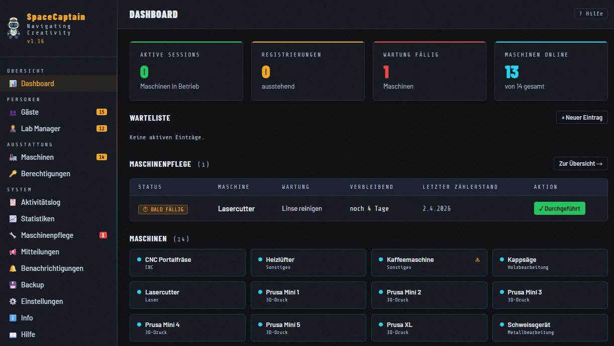
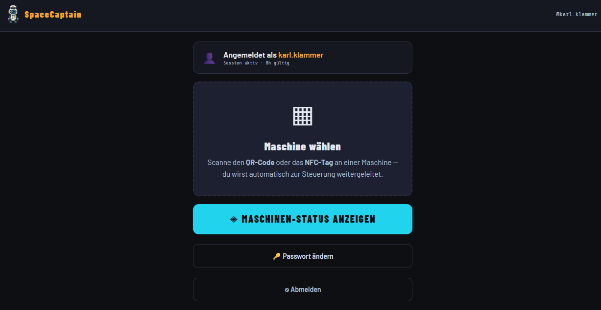

# SpaceCaptain

<p align="center">
  
</p>

SpaceCaptain ist das Verwaltungssystem für deinen Makerspace — Berechtigungen, Maschinensteuerung per Smart Plug und Maschinenpflege in einer App.

Fragen oder Ideen? → [GitHub Issue erstellen](https://github.com/drstrangelove52/spacecaptain/issues) &nbsp;·&nbsp; Projekt nützlich? → [Ko-fi Spende](https://ko-fi.com/pobli) ☕

---

## Features

- **Gästeverwaltung** — Gäste anlegen, Selbstregistrierung mit Freischaltung, Login per Passwort oder Token-Link
- **Maschinenverwaltung** — Maschinen mit Kategorien, Standort, Smart Plug, Leerlauf-Automatik und Betriebsstunden-Tracking
- **Berechtigungs-Matrix** — Zugriffsrechte pro Gast und Maschine mit Sperren, Kommentaren und Verlauf
- **QR-Code & NFC-Tags** — Maschinenfreigabe per QR- oder NFC-Scan mit dem Smartphone
- **Leerlauf-Automatik** — Plug schaltet automatisch aus wenn die Maschine den konfigurierten Verbrauchsschwellwert unterschreitet
- **Maschinenpflege** — Wartungsintervalle nach Betriebsstunden oder Kalendertagen mit Vorwarnung, Dokumentation und Verlauf
- **Warteliste** — Gäste reihen sich ein und werden per Push benachrichtigt wenn die Maschine frei wird
- **Push-Benachrichtigungen** — ntfy-Integration mit persönlichem Topic pro Gast und konfigurierbaren System-Topics für Lab Manager
- **Notfall-Alarm** — Auslösung per physischem Knopf, schaltet Sirene und Blinklicht ein, benachrichtigt Lab Manager per Push
- **Aktivitätslog** — vollständiges Audit-Trail inkl. IP-Adressen
- **Backup / Restore** — automatisches tägliches oder manuelles JSON-Backup aller Daten, Import mit Overwrite- oder Merge-Modus
- **In-App Update** — `git pull` + Docker-Rebuild direkt aus dem Browser auslösen (optional, erfordert einmaligen Host-Setup)
- **Smart Plug Support** — myStrom, Shelly Gen1, Shelly Gen2/Gen3/Gen4

---

## Screenshots

| Dashboard (Lab Manager) | Gäste-Seite |
|:---:|:---:|
|  |  |

---

## Installation

### Voraussetzungen

- Docker und Docker Compose
- Git
- `openssl` und `python3` (auf den meisten Linux-Systemen vorinstalliert)
- Port 80 und 443 frei (änderbar via `HTTP_PORT` / `HTTPS_PORT` in `.env`)

> **Sicherheitshinweis:** SpaceCaptain ist für den Betrieb in einem internen Netzwerk (LAN) konzipiert. Eine direkte Erreichbarkeit aus dem Internet wird nicht empfohlen. Für externen Zugriff sollte ein VPN (z.B. WireGuard) vorgeschaltet werden.

### Schnellinstallation (empfohlen)

```bash
curl -fsSL https://raw.githubusercontent.com/drstrangelove52/spacecaptain/main/install.sh -o install.sh
bash install.sh
```

Das Script stellt drei Fragen, erledigt alles andere automatisch:

1. **Zeitzone** (Standard: aktuelle Server-Zeitzone)
2. **Server-IP oder Hostname** (Standard: automatisch erkannt)
3. **Erster Admin-Benutzer** (Name, E-Mail, Passwort — oder Passwort wird generiert)

Danach sind Repository, `.env`, TLS-Zertifikat, Container und Update-Watcher fertig eingerichtet. Am Ende zeigt das Script die URL und die Zugangsdaten an.

### Manuelle Installation

<details>
<summary>Für fortgeschrittene Nutzer oder abweichende Setups</summary>

```bash
# Repository klonen
git clone https://github.com/drstrangelove52/spacecaptain.git
cd spacecaptain
```

`.env` erstellen und mindestens diese Variablen setzen:

| Variable | Beschreibung |
|----------|-------------|
| `DB_ROOT_PASSWORD` | Sicheres Root-Passwort für MariaDB |
| `DB_PASSWORD` | Datenbankpasswort für die App |
| `JWT_SECRET` | Zufälliger String (mind. 32 Zeichen): `openssl rand -hex 32` |
| `TIMEZONE` | Zeitzone des Servers (z.B. `Europe/Zurich`, `Europe/Berlin`) |
| `ALLOWED_ORIGINS` | HTTPS-URL des Servers (z.B. `https://192.168.1.10`) |

```bash
# TLS-Zertifikat erstellen (Pflicht — ohne Zertifikat startet Nginx nicht)
bash gencert.sh <server-ip-oder-hostname>

# Container bauen und starten
BUILD_NR=$(git rev-list --count HEAD) docker compose up -d --build

# Logs prüfen
docker compose logs -f backend
```

Nach dem Start muss der erste Admin-Benutzer angelegt werden:

```bash
docker compose exec backend python3 -c "
import bcrypt, asyncio
from app.database import AsyncSessionLocal
from app.models import User, UserRole

async def create():
    pw = bcrypt.hashpw(b'dein-passwort', bcrypt.gensalt(12)).decode()
    async with AsyncSessionLocal() as db:
        db.add(User(name='Admin', email='admin@example.com', password_hash=pw, role=UserRole.admin, is_active=True))
        await db.commit()

asyncio.run(create())
"
```

</details>

---

## HTTPS einrichten

Das selbstsignierte Zertifikat liegt in `certs/cert.pem` und `certs/key.pem`. Für ein offizielles Zertifikat (z.B. Let's Encrypt) diese beiden Dateien einfach ersetzen und Nginx neu laden:

```bash
docker exec spacecaptain_proxy nginx -s reload
```

---

## Update

### Manuell (immer möglich)

```bash
git pull
BUILD_NR=$(git rev-list --count HEAD) docker compose up -d --build backend
```

DB-Migrationen laufen automatisch beim Backend-Start.

> **`BUILD_NR`** setzt eine monoton steigende Build-Nummer, die im Sidebar-Footer sichtbar ist (`v1.xx · Build 123`). So ist auf einen Blick erkennbar, ob zwei Server auf demselben Stand sind. Ohne diesen Prefix läuft SpaceCaptain normal — die Build-Nummer wird dann nur nicht angezeigt.

### In-App Update

Der Update-Button unter **Einstellungen → Update** löst `git pull` + `docker compose up --build` direkt aus dem Browser aus. Bei Installation via `install.sh` ist der Update-Watcher bereits eingerichtet und läuft als systemd-Service im Hintergrund. Logs werden in `update_trigger/update.log` geschrieben.

---

## Nützliche Befehle

```bash
# Status aller Container
docker compose ps

# Logs verfolgen
docker compose logs -f backend

# Backend neu starten
docker compose restart backend

# In den Backend-Container einloggen
docker exec -it spacecaptain_backend bash

# Datenbank-Shell öffnen
docker exec -it spacecaptain_db mariadb -u spacecaptain -p spacecaptain

# Kompletten Neustart (⚠️ löscht alle Daten!)
docker compose down -v
BUILD_NR=$(git rev-list --count HEAD) docker compose up -d --build
```

---

## Lizenz

© 2026 Martin Nigg — veröffentlicht unter der **[PolyForm Noncommercial License 1.0.0](https://polyformproject.org/licenses/noncommercial/1.0.0)**.

Nutzung, Weitergabe und Modifikation sind für **nicht-kommerzielle Zwecke** frei erlaubt. Jede kommerzielle Nutzung ist ohne ausdrückliche Genehmigung untersagt.

---

## Kontakt & Unterstützung

Fragen, Ideen oder Fehler gerne als [GitHub Issue](https://github.com/drstrangelove52/spacecaptain/issues) melden.

SpaceCaptain wird in der Freizeit entwickelt — über eine kleine [Ko-fi Spende](https://ko-fi.com/pobli) freue ich mich sehr ☕
